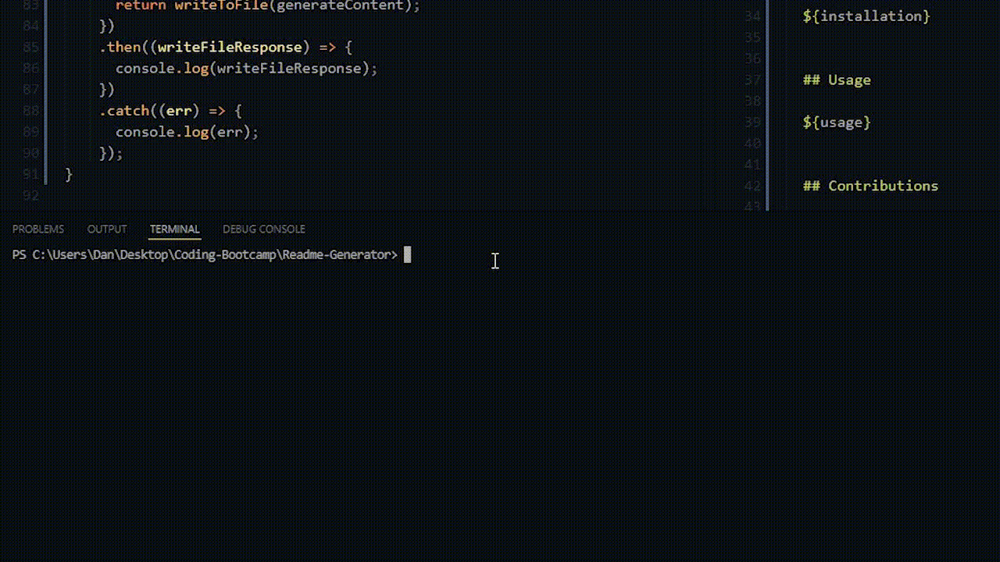
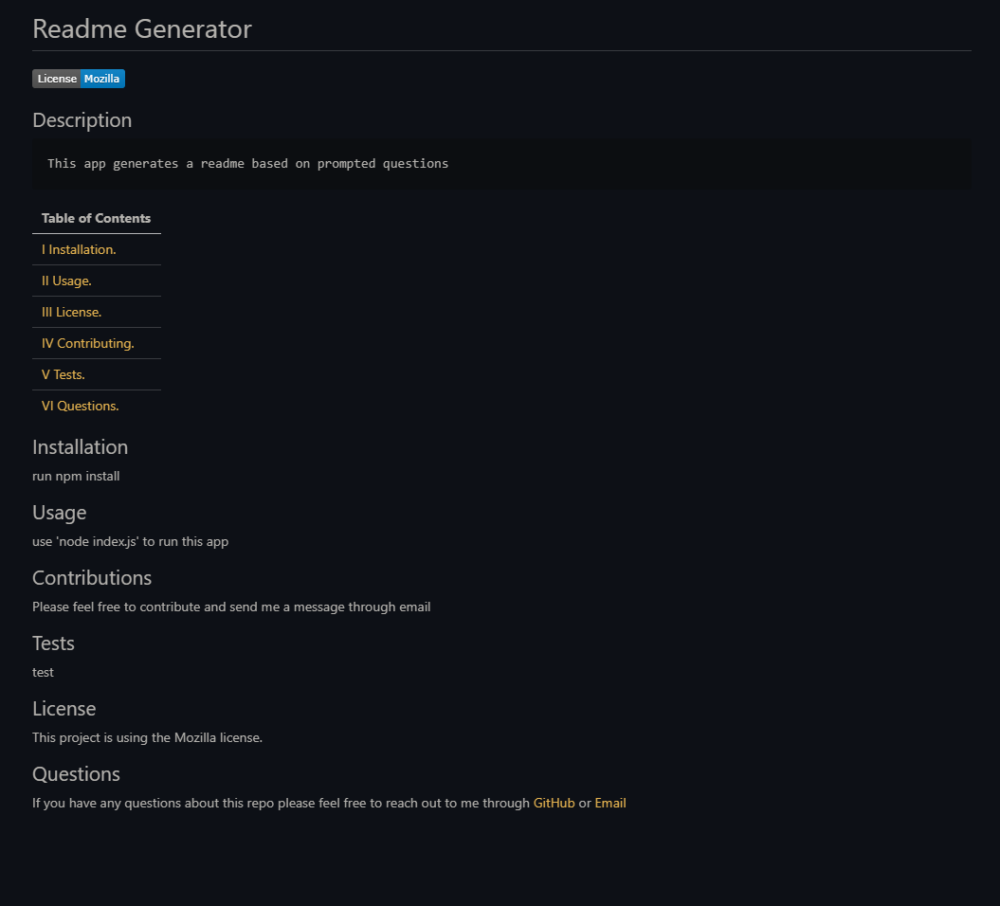

# Readme Generator


## Description

    This app generates a clean, formatted readme based on answers to questions prompted in the command line.

## Built With

```
- Node.js
- Inquirer
- fs
```

| Table of Contents                 |
| --------------------------------- |
| [I Installation.](#installation)  |
| [II Usage.](#usage)               |
| [III License.](#licenses)         |
| [IV Contributing.](#contributing) |
| [V Tests.](#tests)                |
| [VI Questions.](#questions)       |

## Installation

Clone the repo

```
git clone https://github.com/wratten/readme-generator.git`
```

Install dependencies

```
npm install
```

## Usage

This readme generator can be used to save time writing and formatting a Readme file every single time you make a new project, so you can spend less time doing tedious work, and more time coding!

To run this app,

```
node index.js
```




## Contributions

Contributions are what make the open source community such an amazing place to learn, inspire, and create. Any contributions you make are greatly appreciated.

If you have a suggestion that would make this better, please fork the repo and create a pull request. Thanks again!

---

Special thanks to:

Kyle Bario | [GitHub](https://github.com/kbario)

Hannah Allison-Batt | [GitHub](https://github.com/HannahAB777)

For their contributions and assistance in building this project.

---

## Tests

No tests have been developed for this app.

## License

This project is using the MIT license.

## Questions

If you have any questions about this repo please feel free to reach out to me through [GitHub](https://github.com/Wratten) or by [Email](mailto:daniel.wratten@gmail.com).
